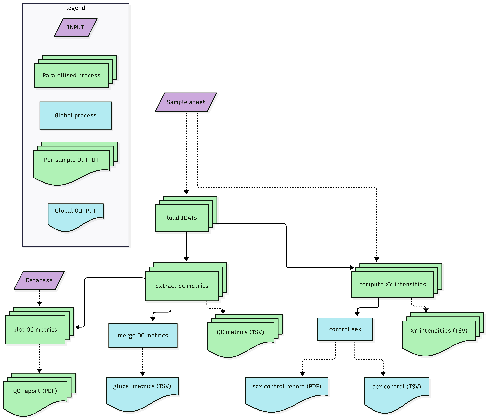

# MethylHome

## Description

**MethylHome** is a Nextflow DSL2 pipeline for processing Illumina IDAT files, extracting quality control (QC) metrics, and generating per-sample QC reports.



## Overview

This pipeline performs the following steps:

1. Load IDAT files (Green/Red channels)
2. Extract QC metrics per sample
3. Generate per-sample QC reports (PDF format)
4. Aggregate QC metrics into a global summary file
5. Perform gender consistency checks (PDF report and CSV output)

All steps are fully parallelized, ensuring independent processing of each sample without output overlap.

## Dependencies
* Nextflow (tested with versions 24.10.4 and 25.10.4)
* Singularity (tested with version CE 3.8.0)

## Input Data
Required inputs

- **Sample sheet** (`--sample_sheet`)  
A CSV file following the BeadArray template, with an additional column containing paths to IDAT files (without the `_{Grn|Red}.idat` suffix).

The minimal file should contain : 

| Sample_Name | Sample_IDAT | Gender | file_path |
| ----- | ----- | ----- | ----- |
| GSM8461134 | GSM8461134_207716530108_R01C01 | M | path/to/GSM8461134_207716530108_R01C01 |

For the gender column, possibilities are : 
`F`, `M` or `U`.

- **Database file** (`--database`)  
Reference database used for QC visualization.

- **Output directory** (`--output`)  
Directory where results will be written.

Test files are available in this repository:
* IDAT test files (data/test/),
* Sample sheet corresponding to input files (data/MethylationEPIC_Sample_Sheet_test_data.csv),
* A QC reference files for ploting metrics (data/qc_metrics_output_db.tsv).

## Output files 

All results are written to the directory specified via `--output`. The pipeline generates a structured set of summary files, per-sample metrics, and graphical reports as illustrated below:
```
.
└── qc
├── all_predicted_sex.tsv
├── all_qc_metrics.tsv
├── control_sex_report.pdf
├── sample_metrics
│ └── <sample_name>_qc_metrics_output.tsv
├── sample_plots
│ └──<sample_name>_qc_plot.pdf
└── sample_sex
└── <sample_name>_xy_intensities.tsv
```

### Global QC outputs (`qc/`)

- **`all_predicted_sex.tsv`**  
  Summary table containing sex prediction inferred from methylation profiles for all samples.  
  Includes a concordance check against the `Gender` column provided in the sample sheet.

- **`all_qc_metrics.tsv`**  
  Aggregated table of all computed QC metrics across samples.

- **`control_sex_report.pdf`**  
  Global diagnostic plot displaying X and Y chromosome methylation intensities across all samples.  
  Useful for identifying outliers and verifying sex annotation consistency.

### Per-sample QC metrics (`qc/sample_metrics/`)

- One file per sample:
  - **`<sample_name>_qc_metrics_output.tsv`**  
    Contains the full set of QC metrics computed for the given sample. 

### Per-sample QC reports (`qc/sample_plots/`)

- One PDF report per sample:
  - **`<sample_name>_qc_plot.pdf`**  
    Visual summary of QC metrics, enabling rapid identification of potential quality issues.

### Sex-specific intensities (`qc/sample_sex/`)

- One file per sample:
  - **`<sample_name>_xy_intensities.tsv`**  
    Reports methylation signal intensities for X and Y chromosomes.  
    These values are used internally for sex prediction and can also support external validation.

### File format conventions

All output tables follow standard “Anglo-Saxon” format:

- Tab-delimited format (`.tsv`)
- Decimal separator: `.` (dot)
- Header line included in all tables

## Singularity container

### Pre-build container
Containers are available on Sylabs' [Singularity Container Services](https://cloud.sylabs.io/). They can be pulled manually or automatically by Nextflow using the `library://...` syntax. 

Repository URL :
[https://cloud.sylabs.io/library/judrnd/hcl/methylhome](https://cloud.sylabs.io/library/judrnd/hcl/methylhome)

Available tags :
* `metyhylhome:0.1`
* `methylhome:latest`

### Building the container 

The container recipe is part of MethylHome's source code, it can be built with :
```bash
sudo singularity build MethylHome_latest.sif MethylHome_QC.def
```

The image can also be directly pulled from internet : 

```bash
singularity pull --arch amd64 library://judrnd/hcl/methylhome:latest
```

## Usage

```bash
# Sample_sheet and database
sample_sheet="$(pwd)/data/MethylationEPIC_Sample_Sheet_test_data.csv"
database="$(pwd)/data/qc_metrics_output_db.tsv"

# Define output folder
out="$(pwd)/output"

# Launch pipeline
nextflow run main.nf -with-singularity "library://judrnd/hcl/methylhome:latest" \
                    --sample_sheet "$sample_sheet" \
                    --database "$database" \
                    --output "$out" 

```

## Acknowledgment
Thanks to Yvan Nicaise for original QC scripts that were adapted and extended in this pipeline.

## License
This project is placed under MIT license (Copyright 2026).