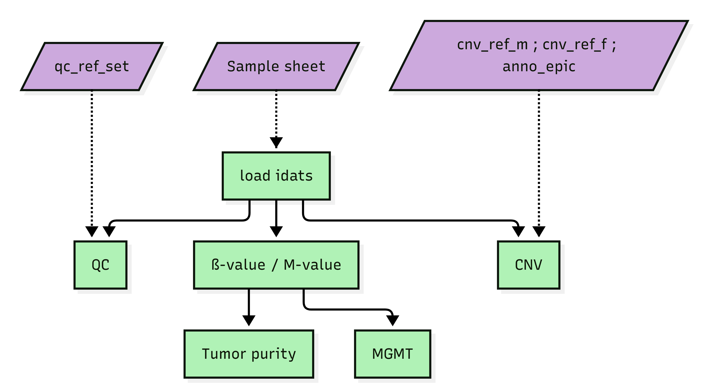
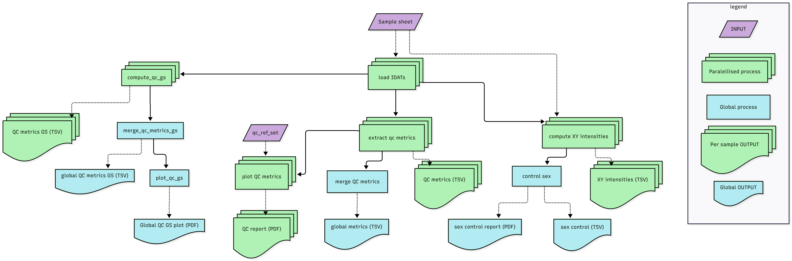

# MethylHome

- [Description](#description)
- [Overview](#overview)
- [Dependencies](#dependencies)
- [Input Data](#input-data)
- [Test Data](#test-data)
- [Modules](#modules)
    - [Quality Control](#quality-control)
    - [Sex Concordance Control](#sex-concordance-control)
    - [CNV Analysis](#cnv-analysis)
    - [MGMT Methylation Status](#mgmt-methylation-status)
    - [Tumor Purity Estimation](#tumor-purity-estimation)
- [Output Structure](#output-structure)
- [Singularity Container](#singularity-container)
- [Usage](#usage)
- [Documentation](#documentation)
- [Acknowledgments](#acknowledgments)
- [License](#license)

## Description

**MethylHome** is a Nextflow DSL2 pipeline designed for the analysis of Illumina methylation array data from IDAT files. Some CNV analyses (focal CNV inference and associated visualizations) require internet access and can be disabled for offline execution using `--CNV_focal FALSE`.

The pipeline provides:

* quality control metric extraction;
* generation of per-sample QC reports;
* sex concordance checking based on X and Y chromosome intensities;
* copy number variation (CNV) inference from methylation data;
* MGMT promoter methylation status prediction;
* tumor purity estimation.

> **Complete documentation**, including descriptions of all pipeline processes, parameters, methodologies, and outputs, is available in [doc/MethylHome_doc.md](doc/MethylHome_doc.md).

### Workflow

The global workflow is illustrated below.



### Quality Control workflow



## Overview

MethylHome performs the following analyses:

- Loading of Illumina IDAT files;
- Extraction of QC metrics;
- Generation of per-sample QC reports;
- Aggregation of QC metrics across all samples;
- Extraction of raw GenomeStudio-like control probe values;
- Generation of cohort-level GenomeStudio-like QC plots;
- Sex prediction based on chromosome X and Y intensities;
- Sex concordance verification against the sample sheet;
- CNV inference from methylation data;
- MGMT promoter methylation status prediction;
- Tumor purity estimation.

All steps are fully parallelized, ensuring independent processing of each sample without output overlap.

## Dependencies

* Nextflow (tested with versions 24.10.4 and 25.10.4)
* Singularity CE (tested with version 3.8.0)

### Internet access

An internet connection is required when focal CNV inference is enabled.

The focal CNV detection workflow and the associated region-of-interest visualizations rely on external resources and therefore cannot be executed in a fully offline environment.

For offline execution, focal CNV analysis can be disabled using the `--CNV_focal` parameter.


## Input Data

### Required inputs

#### - **Sample sheet** (`--sample_sheet`)  
A CSV or TSV file following the BeadArray template, with an additional column containing paths to IDAT files (without the `_{Grn|Red}.idat` suffix).

The minimal file should contain : 

| Sample_Name | Sample_IDAT | Gender | file_path |
| ----- | ----- | ----- | ----- |
| GSM8461134 | GSM8461134_207716530108_R01C01 | M | path/to/GSM8461134_207716530108_R01C01 |


Where:

* **Sample_Name**: unique sample identifier.
* **Sample_IDAT**: Sentrix ID and Sentrix Position combination.
* **Gender**: `M`, `F` or `U`.
* **file_path**: path to IDAT files without the `_Grn.idat` or `_Red.idat` suffix.

**Important**: if the sample sheet contains empty lines before the header line (`Sample_Name`), the pipeline may not parse the file correctly. Any lines preceding the header should therefore contain at least one character.

### Main optional inputs

| Parameter | Description |
|-----------|-------------|
| `--output` | Output directory |
| `--publish` | Nextflow publish mode |
| `--qc_ref_set` | QC reference dataset |
| `--ref_m` | Male CNV reference |
| `--ref_f` | Female CNV reference |
| `--ref_mf` | Mixed-sex CNV reference |
| `--anno` | CNV genomic annotation |
| `--CNV_focal` | Enable or disable focal CNV detection |

> A complete list of available parameters is provided in the documentation.

#### - **Output directory** (`--output`)

Directory where all pipeline results will be written.

#### Publish mode (`--publish`)

Nextflow publish mode.

Available values:

* `copy`
* `copyNoFollow`
* `link`
* `move`
* `rellink`
* `symlink`

Default: `copy`

#### QC reference dataset (`--qc_ref_set`)

Reference QC dataset used to visualize sample metrics relative to a reference population.

#### Male CNV reference (`--ref_m`)

`.Rdata` object used as reference for CNV normalization of male samples.

#### Female CNV reference (`--ref_f`)

`.Rdata` object used as reference for CNV normalization of female samples.

#### Mixed CNV reference (`--ref_mf`)

`.Rdata` object used as reference for CNV normalization of unknown sex samples.

#### CNV annotation (`--anno`)

`.Rdata` object containing genomic binning information used by the CNV workflow.

#### Focal CNV detection (`--CNV_focal`)

`TRUE` or `FALSE`.

Determines whether focal CNV inference and the associated region-of-interest visualizations are generated by the pipeline.

> Since these analyses require an internet connection, this parameter must be set to `FALSE` when running the pipeline in an offline environment.

Default value:

```text
TRUE
```


## Test Data

Example files are available in the repository:

* test IDAT files (`data/test/`);
* example sample sheet;
* QC reference dataset.

A QC reference dataset can be generated from a set of samples using:

```bash
singularity exec -B $(pwd) \
    library://judrnd/hcl/methylhome:latest \
    Rscript resources/compute_dataset_qc_metrics.R data/test/ .
```

## Modules

### Quality Control

The QC module computes quality metrics directly from raw Illumina methylation array data using the `ewastools` package.

The module includes:

* BeadArray control metrics;
* methylated and unmethylated signal intensities;
* detection p-value distributions;
* beta-value distributions;
* GenomeStudio-like control probe values;
* comparison with a reference cohort.

Outputs include:

* per-sample QC reports;
* per-sample QC metrics;
* aggregated QC tables;
* GenomeStudio-like cohort reports.

### Sex Concordance Control

Sex prediction is performed using chromosome X and Y signal intensities.

Predicted sex is compared with the sex provided in the sample sheet.

Outputs include:

* per-sample X/Y intensities;
* cohort-level sex concordance report;
* aggregated prediction table.

### CNV Analysis

CNV inference is performed using the R package `conumee2`.

The workflow includes:

* tangent normalization against reference samples;
* genomic binning;
* segmentation;
* focal CNV detection;
* generation of CNV visualizations and summary files.

Separate male and female reference datasets are used to reduce biases associated with sex chromosomes.

For EPICv2 arrays, studied sample is duplicated during processing to work around current `conumee2` limitations.

Focal CNV detection and the associated region-of-interest visualizations can be disabled using `--CNV_focal FALSE`, allowing the pipeline to be executed without internet access.

### MGMT Methylation Status

MGMT promoter methylation status is predicted using the `mgmtstp27` package.

The prediction is based on the methylation levels of probes:

* cg12434587
* cg12981137

No normalization is applied before MGMT prediction.

The module generates a PDF report containing:

* predicted MGMT status;
* confidence intervals associated with the prediction.

### Tumor Purity Estimation

Tumor purity is estimated using the `RFpurify` package.

Two independent models are applied:

* `absolute`
* `estimate`

Since RFpurify was originally trained on HumanMethylation450K arrays, probe identifiers are adapted when EPICv2 arrays are analyzed.

For probes required by the models but absent from EPICv2 arrays, default value of 0.5 is applied.

Reported results correspond to:

* the mean prediction;
* the associated confidence interval.

## Output Structure

Results are organized by module within the output directory.

Example QC structure:

```text
output/
├── cnv
│   ├── all_CNV_detail.txt
│   ├── all_CNV_metrics.txt
│   ├── all_CNV_segment.seg
│   ├── plots
│   │   ├──`Sample_Name`_`Sample_IDAT`_AllChr.png
│   │   ├──`Sample_Name`_`Sample_IDAT`_Genes.png
│   │   ├── chr
│   │   │   └──`Sample_Name`_`Sample_IDAT`_chr*.png
│   │   └── gene
│   │   │   └──`Sample_Name`_`Sample_IDAT`_`Region`_Gene.png
│   └── tables
│       ├── `Sample_Name`_`Sample_IDAT`_CNVbins.igv
│       ├── `Sample_Name`_`Sample_IDAT`_CNVdetail.txt
│       ├── `Sample_Name`_`Sample_IDAT`_CNVprobes.igv
│       ├── `Sample_Name`_`Sample_IDAT`_CNVsegments.seg
│       └── `Sample_Name`_`Sample_IDAT`_metrics.txt  
├── mgmt
│   └── MGMT_plot_minfi_`Sample_Name`.pdf
├── qc
│   ├── all_predicted_sex.tsv
│   ├── all_qc_metrics.tsv
│   ├── all_qc_metrics_gs.tsv
│   ├── control_sex_report.pdf
│   ├── genome_studio_like_plot.pdf
│   ├── sample_metrics
│   │   └── `Sample_Name`_qc_metrics_output.tsv
│   ├── sample_plots
│   │   └── `Sample_Name`_qc_plot.pdf
│   └── sample_sex
│       └── `Sample_Name`_xy_intensities.tsv
└── tumor_purity
    └── `Sample_Name`_tumor_purity.pdf
```

### Output formats

All tabular outputs:

* use tab-separated values (`.tsv`);
* use `.` as decimal separator;
* include a header row.

## Singularity Container

### Pre-built container

Containers are available on Sylabs' [Singularity Container Services](https://cloud.sylabs.io/). They can be pulled manually or automatically by Nextflow using the `library://...` syntax. 

Repository URL :
[https://cloud.sylabs.io/library/judrnd/hcl/methylhome](https://cloud.sylabs.io/library/judrnd/hcl/methylhome)

Available tags :
* `metyhylhome:0.1`
* `methylhome:latest`

### Build from source

```bash
sudo singularity build MethylHome_latest.sif MethylHome.def
```

### Pull image

```bash
singularity pull --arch amd64 \
    library://judrnd/hcl/methylhome:latest
```

## Usage

Before running CNV analysis for the first time, you need to generate the required reference objects.

### 1. Download IDAT files

Download the IDAT files from the GEO accession:
[GSE306226](https://www.ncbi.nlm.nih.gov/geo/query/acc.cgi?acc=GSE306226)

### 2. Create CNV reference objects

Run the following script to generate the reference objects:

```bash
singularity exec -B $(pwd) "library://judrnd/hcl/methylhome:latest" \
Rscript resources/create_objects_for_CNV.R <GEO_IDAT_directory> <outdir>
```

* `<GEO_IDAT_directory>`: path to the downloaded IDAT files
* `<outdir>`: directory where output objects will be saved. . If this is different from $(pwd), you must also pass it explicitly to Nextflow when launching the pipeline with the arguments : 
* `ref_m`, 
* `ref_f`, 
* `ref_mf`,
* `anno_epic`.

### 3. Run the pipeline

Once the reference objects are created, launch the pipeline with Nextflow:

```bash
sample_sheet="$(pwd)/data/MethylationEPIC_Sample_Sheet_test_data.csv"
out="$(pwd)/output"

nextflow run main.nf \
    -with-singularity "library://judrnd/hcl/methylhome:latest" \
    --sample_sheet "$sample_sheet" \
    --output "$out"
```

## Documentation

The [doc/MethylHome_doc.md](doc/MethylHome_doc.md) file contains comprehensive documentation covering:

* Pipeline architecture;
* Description of every Nextflow process;
* Complete parameter reference;
* Module documentation;
* Input and output specifications;
* QC methodology;
* CNV methodology;
* Preprocessing methods;
* Developer notes.


## Acknowledgments

This pipeline integrates several open-source Bioconductor and R packages, including:

* ewastools;
* minfi;
* conumee2;
* mgmtstp27;
* RFpurify.

Special thanks to **Yvan Nicaise**, whose original QC and CNV scripts were adapted and extended within MethylHome.

## License

GNU GPL3 License

Copyright © 2026
